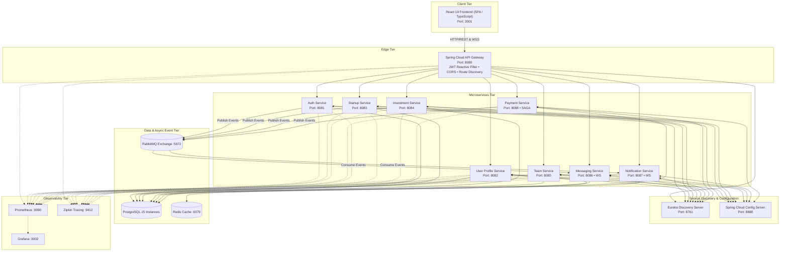
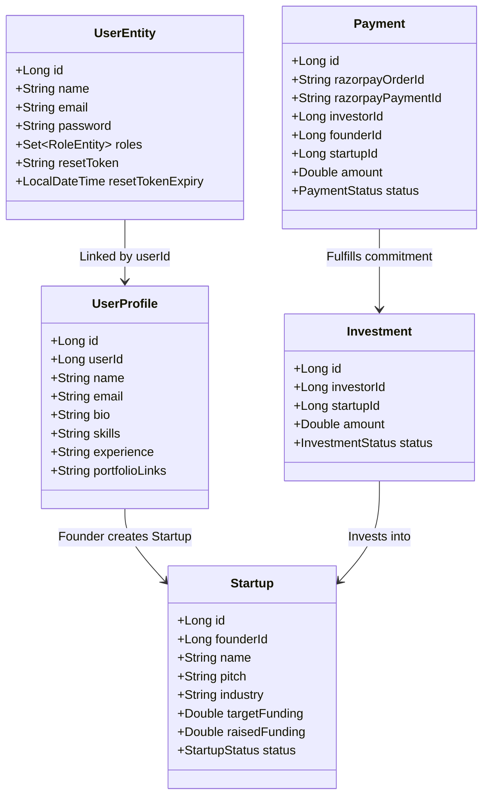
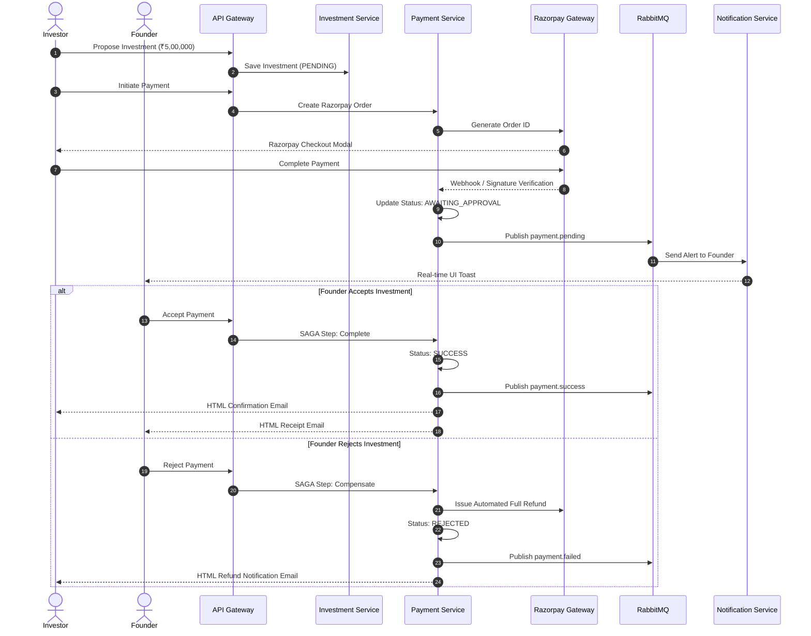

# FounderLink — Comprehensive Project Architecture & Technical Report

---

## 1. Executive Summary

**FounderLink** is an enterprise-scale, microservices-based SaaS platform designed to unite startup founders, co-founders, and investors into a single cohesive ecosystem. It facilitates end-to-end startup acceleration: from idea pitching and co-founder matchmaking to direct encrypted negotiations, milestone-based investment commitments, and integrated payment processing with SAGA distributed transaction guarantees.

The platform is built using a modern decoupled architecture:
- **Frontend**: React 19, TypeScript, Vite, TailwindCSS, Redux Toolkit, and STOMP WebSockets.
- **Backend**: Spring Boot 3.x, Spring Cloud (Eureka, Gateway, Config Server), Spring Security (Stateless JWT), and Spring Data JPA.
- **Data & Messaging**: PostgreSQL 15 per-service isolated databases, Redis distributed caching, and RabbitMQ event streaming.
- **Resilience & Distributed Workflows**: SAGA Orchestration pattern with automated compensation (refunds) and circuit breaker resilience.
- **Observability**: Prometheus, Grafana, Micrometer, Actuator, and OpenZipkin distributed tracing.

---

## 2. High-Level Design (HLD)

### 2.1 System Architecture



### 2.2 Key Architectural Principles
1. **Database-per-Service**: Each microservice maintains its own logical schema in PostgreSQL to guarantee strict domain isolation and eliminate shared-database coupling.
2. **Centralized Edge & Authentication**: API Gateway acts as the single entry point. A reactive `JwtAuthenticationFilter` inspects incoming Authorization headers, validates cryptographic signatures, and extracts `userId` and `roles`, forwarding them downstream via standard headers (`X-User-Id`, `X-User-Roles`).
3. **Event-Driven Decoupling**: Non-blocking asynchronous communications (e.g., sending emails, broadcasting in-app notifications, updating audit logs) are driven by RabbitMQ topics and exchanges.
4. **Resilience & Transactional Integrity (SAGA)**: Multi-service operations (such as payment processing -> investment confirmation -> email dispatch) are coordinated using an Orchestrated SAGA with compensation transactions (auto-refund on rejection).

---

## 3. Low-Level Design (LLD)

### 3.1 Service-by-Service Breakdown



#### 1. API Gateway (`api-gateway` :8080)
- **Technology**: Spring Cloud Gateway, WebFlux, Netty.
- **Routing Rules**:
  - `/auth/**` -> `AUTH-SERVICE`
  - `/users/**` -> `USER-SERVICE`
  - `/startups/**` -> `STARTUP-SERVICE`
  - `/investments/**` -> `INVESTMENT-SERVICE`
  - `/teams/**` -> `TEAM-SERVICE`
  - `/messages/**` -> `MESSAGING-SERVICE`
  - `/notifications/**` -> `NOTIFICATION-SERVICE`
  - `/api/payments/**` -> `PAYMENT-SERVICE`
- **Filters**:
  - `JwtAuthenticationFilter`: Decodes HMAC-SHA256 tokens, verifies expiry, injects identity attributes into downstream requests.
  - `DedupeResponseHeader`: Removes duplicate CORS headers (`Access-Control-Allow-Origin`, `Access-Control-Allow-Credentials`).

#### 2. Auth Service (`AuthService` :8081)
- **Security**: BCrypt hashing (strength 10), stateless JWT tokens (access token: 15 min, refresh token: 7 days).
- **Entities**: `UserEntity`, `RoleEntity` (`ROLE_FOUNDER`, `ROLE_INVESTOR`, `ROLE_COFOUNDER`, `ROLE_ADMIN`).
- **Endpoints**:
  - `POST /auth/register`: Creates new user account, triggers `WelcomeEmailService`, and publishes `user.registered` event to RabbitMQ.
  - `POST /auth/login`: Authenticates credentials and returns access + refresh tokens.
  - `POST /auth/refresh-token`: Rotates access token via valid refresh token.
  - `POST /auth/forgot-password` & `POST /auth/reset-password`: Time-bound UUID token generation and email link delivery.

#### 3. User Profile Service (`user-service` :8082)
- **Architecture**: CQRS Separation (`UserProfileCommandService`, `UserProfileQueryService`).
- **Caching**:
  - `@Cacheable(value = "userProfiles", key = "#userId")` for individual profile reads.
  - `@Cacheable(value = "userSkillSearch", key = "#keyword")` for skill lookups.
  - `@CacheEvict` on profile mutations.
- **Key Features**: Auto-provisioning empty profile shells for first-time users, batch fetching profile lists for team rosters.

#### 4. Startup Service (`startup-service` :8083)
- **Entities**: `Startup`, `PitchDeck`, `FundingGoal`.
- **Status Lifecycle**: `DRAFT` -> `SUBMITTED` -> `APPROVED` / `REJECTED` -> `FUNDED`.
- **Features**: Pitch deck uploads, traction metrics, sector categorization (FinTech, AI, HealthTech, EdTech, SaaS, GreenTech).

#### 5. Investment Service (`InvestmentService` :8084)
- **Entities**: `Investment`, `InvestmentStatus` (`PROPOSED`, `ACCEPTED`, `REJECTED`, `COMPLETED`).
- **Workflow**: Investors submit term proposals; founders accept or negotiate terms; integrates with Payment Service upon deal acceptance.

#### 6. Team & Collaboration Service (`TeamService` :8085)
- **Entities**: `TeamMember`, `TeamInvitation` (`PENDING`, `ACCEPTED`, `REJECTED`).
- **Features**: Founders search talent by skill tags (e.g. `React`, `Python`, `ML`, `DevOps`) and issue formal equity/role invitation offers.

#### 7. Messaging Service (`MessagingService` :8086)
- **Protocol**: STOMP over SockJS (`/ws`), REST message history fallback.
- **Endpoints**:
  - `/topic/messages/{conversationId}`: Real-time bilateral chat room.
  - `/user/{userId}/queue/messages`: Direct private notifications.

#### 8. Notification Service (`NotificationService` :8087)
- **Consumers**: RabbitMQ message listener (`founderlink.queue.notifications`).
- **Real-time Push**: Emits STOMP notifications to connected frontend clients when investments are received, invitations are extended, or payments are processed.

#### 9. Payment Service (`PaymentService` :8088)
- **Gateway Integration**: Razorpay Java SDK v1.4.5.
- **Pattern**: Orchestrated SAGA Pattern (`SagaOrchestrator`).
  ```
  Step 1: Create Razorpay Order (Status: PENDING)
  Step 2: Client Completes Checkout -> Signature Verified (Status: AWAITING_APPROVAL)
  Step 3: Founder Reviews & Approves:
          -> SUCCESS: Transact capital, emit `payment.success`, send Investor + Founder receipt emails.
          -> REJECTED: Trigger Compensation: Call Razorpay Refund API, emit `payment.failed`, send refund notification email.
  ```

---

## 4. Frontend Architecture (`founderlink-final`)

- **Tech Stack**: React 19 + TypeScript + Vite + TailwindCSS.
- **State Management**: Redux Toolkit slices:
  - `authSlice`: User credentials, token storage, active role permissions.
  - `startupSlice`: Cached startup listings, filter states, detail views.
  - `notificationSlice`: Real-time notification badge counts and alert toasts.
  - `themeSlice`: Light / Dark aesthetic mode toggles.
- **Role-Based Routing**:
  - **Founder Portal**: Create/Edit Startups, Team Management, Received Payments, Investor Inquiries.
  - **Investor Portal**: Browse Startups, Financial Due Diligence, Portfolio Tracking, Payment History.
  - **Co-Founder Portal**: Skill Showcase, Startup Matching, Invitation Inboxes.
  - **Admin Portal**: Platform Analytics, Startup Moderation & Approval queues.

---

## 5. End-to-End Application Use Cases



---

## 6. Future Enhancements & Roadmap

1. **AI-Powered Matching Engine**:
   - Machine learning algorithms to analyze investor thesis vs. startup pitch decks for automated compatibility scores.
   - Smart co-founder candidate recommendations using vector embeddings (OpenAI / Gemini Embeddings) over user skill vectors.
2. **Cap Table Management**:
   - Automated equity dilution calculator and convertible note (SAFE / KISS) generator.
3. **Escrow Smart Contracts (Web3 / Multi-Sig)**:
   - Milestone-locked release of capital based on verified deliverables and stakeholder approvals.
4. **Video Pitching & Virtual Demo Days**:
   - Integrated WebRTC live video streaming for investor pitch sessions and interactive Q&A.
5. **Kubernetes (Helm) Production Deployment**:
   - Automated autoscaling (HPA) for high-traffic microservices (API Gateway, Messaging) and GitOps CI/CD pipeline.

---

## 7. Operational & Verification Metrics

- **Microservices Count**: 11 Backend Services + 1 React Single Page App.
- **Test Suite Status**: 100% Passing across all unit & integration tests (`mvn test`).
- **Build Quality**: Zero TypeScript compilation warnings (`tsc && vite build`).
- **Containerization**: Fully automated multi-container configuration via Docker Compose.
